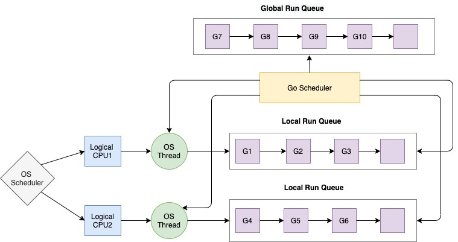
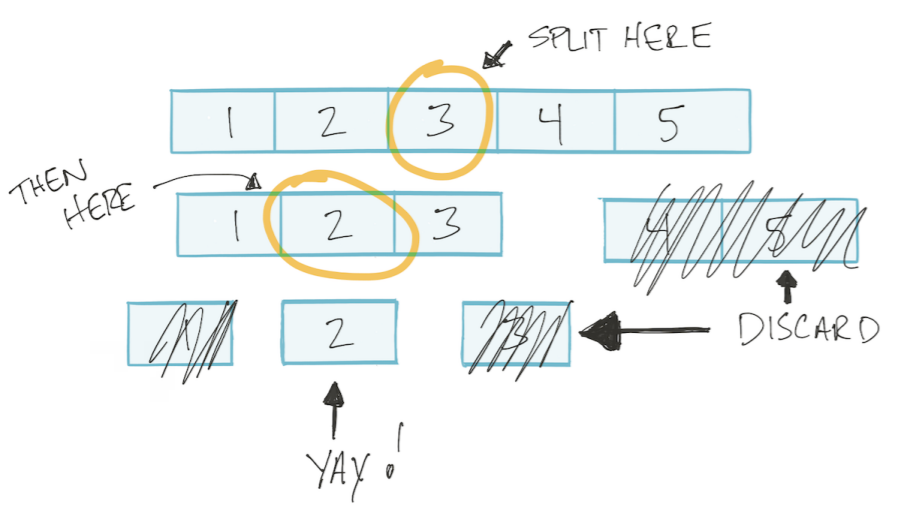

# OOD
## GoF Design Patterns
https://refactoring.guru/design-patterns \
https://github.com/AlexanderGrom/go-patterns

### Creational
#### Singleton
Asserts that the whole application will have single instance of certain object
and provides global access point to that object. The access to the object goes 
through the "GetInstance" method.

#### Factory Method
Defines an interface (with method "Create") that allows creating different
implementations of an object.

#### Abstract Factory
Defines an interface with bunch of methods like `CreateCarcass`, `CreateEngine`,
`CreateWheels`, it can be implemented in various ways (sportcar, pickup, truck). \
The main point is that end users are not aware of what exact implementation they use.
Instead, correct concrete factory will be chosen at runtime at the initialization stage.
The app must select the factory type depending on the configuration or the environment settings.
(e.g. when writing GUI application choose btw `WinWindow`, `MacWindow`, `GnomeWindow`)

#### Builder
Allows to create objects with different options. Every Builder's method
returns Builder itself, so it's convenient to chain methods. There is
also might be a Director - an object that contains builder and has method "Construct"
that creates Builder's instance with predefined options, but this is optional.

#### Prototype
Allows to copy object with it's state. Defines an interface with method "Clone"
that returns same interface. Under the hood implementation creates new instance with
same fields as Prototype. Used for objects with non-copyable fields.

### Structural
#### Adapter
Transforms object of one type to another. Adapter doesn't have any strict 
form (interface or something) and can be implemented in various ways.

- Struct that contains existing and target objects via composition
and overrides target object's methods, then access to the target performs through
that struct.
- Can be a struct that implements target interface and contains existing. (most popular)
- Can be a simple function that accepts existing and returns target.

```go
// Target provides an interface with which the system should work.
type Target interface {
	Request() string
}

// Adaptee implements system to be adapted.
type Adaptee struct {}

// SpecificRequest implementation.
func (a *Adaptee) SpecificRequest() string {
	return "Request"
}

// NewAdapter is the Adapter constructor.
func NewAdapter(adaptee *Adaptee) Target {
	return &Adapter{adaptee}
}

// Adapter implements Target interface and is an adapter.
type Adapter struct {
	*Adaptee
}

// Request is an adaptive method.
func (a *Adapter) Request() string {
	return a.SpecificRequest()
}
```

#### Bridge *(Dependency injection)*
Lets split a large class or a set of closely related classes into separate
hierarchies-abstraction and implementation which can be developed independently of each other.
Resulting structure contains different objects over composition and interacts with them. Use the pattern
when you need to extend a class in several orthogonal (independent) dimensions.

#### Composite *(Tree-like)*
```go
// Component provides an interface for branches and leaves of a tree.
type Component interface {
	Add(child Component)
	Name() string
	Child() []Component
	Print(prefix string) string
}
```

#### Decorator
Attaches new behaviors to objects by placing these objects inside the special 
wrapper object that contains behavior.

```go
// implements io.Writer
type TransportWriter struct{}
func (TransportWriter) Write(p []byte) (n int, err error) { /*...*/ }

func NewCompressionWriter(w io.Writer) io.Writer {
	return CompressionDecorator{w}
}

type CompressionDecorator struct{ writer io.Writer }
func (c CompressionDecorator) Write(p []byte) (n int, err error) {
	// compress than write
	return c.Write(p)
}
```

#### Proxy
Proxy intercepts calls to the real object before or after and can extend, perform validation, cache etc.
Similar to Decorator, but Decorator gets reference for decorated object (usually through constructor)
while Proxy responsible to do that by itself. Proxy also implements objects interface.

```go
// implements io.Writer
type TransportWriter struct{}
func (TransportWriter) Write(p []byte) (n int, err error) { /*...*/ }

// creates transportWriter
func NewCompressionProxy() io.Writer {
	transportWriter := new(TransportWriter)
	return CompressionProxy{transportWriter}
}

type CompressionProxy struct{ writer io.Writer }
func (c CompressionProxy) Write(p []byte) (n int, err error) {
	// compress than write
	return c.Write(p)
}
```

#### Facade
Hides complex logic (hierarchy) behind simple interface.

#### Flyweight *(Cache)*
Let's say you have ton of similar objects. You are creating a Flyweight (factory) that
responsible for creating objects with given parameters, but before return such object it
saves it to underlying array and next time you'll need it, Flyweight
will get it from that array.

### Behavioral
#### Chan of responsibility
Allows pass requests along a chain of handlers. Upon receiving a request, each handler
decides either to process the request or to pass it to the next handler in the chain.\
There are two possible implementations:
- If one part of chain fails, no further processing performs.
- Different way - stop processing on success.

#### Command
Sender -> Command -> Receiver

Creates middle layer set of commands where every command represented by its own class
with common interface. (usually with one method `Execute()`) It requires additional layer
to bound Commands to Senders. On initialization, Command gets Receiver’s instance.
After that command may be assigned to Sender. Sender stores a list of Commands, and methods
to add, remove and execute them, this allows to dynamically change Sender’s behavior.

```
Senders
[] [] [] [] [] []
    Commands
    [] [] []
       Receiver
       []
```

#### Iterator
Moves iteration logic to its own object. Allows to easily implement different iteration
methods for COMPLEX DATA. There is usually just interface with methods like `Next()`,
`HasNext()`, `GetValue()` etc.

#### Mediator
The pattern restricts direct communications between the objects and forces them to collaborate
only via a mediator object. Mediator contains all initialized objects that has to communicate
with each other and each object contains Mediator's instance.

The Mediator is about the interactions between "colleague" objects who don't know each other.
encapsulates the interaction between several colleague objects in order to isolate them from each other.


#### Observer
Lets you define a subscription mechanism to notify multiple objects about any events 
that happen to the object they’re observing.

#### Memento
Allows to save and restore the previous state of an object.

#### State
Lets an object alter its behavior when its internal state changes. It appears as if the object
changed its class. There is method like `SetState(IState)` and everything method does goes through
it's state.

E.g phone call mode (silent, vibration, sound).

#### Strategy
The Strategy pattern is really about having a different implementation that accomplishes
the same thing, so that one implementation can replace the other as the strategy requires. For example,
there might be different sorting algorithms in a strategy pattern. 

#### Template Method
Defines an interface. Defines base struct with methods common for all objects that implements that interface.
Every method overrides **some** of the methods (that should differ).

#### Visitor
You have bunch of objects with common interface. Each object need to get one more method but without changing their interface.
You define Visitor interface that have additional method for each object. Then you define method
Accept(Visitor) for each class (yep, you actually changing it). And each Accept just calls the method it needs.

```go
type Visitor interface {
	VisitSquare()
	VisitCircle()
}

type Shape interface {
	Accept(Visitor)
}

type Square struct{}
func (s Square) Accept(v Visitor) {
	v.VisitSquare()
}

type Circle struct{}
func (s Circle) Accept(v Visitor) {
	v.VisitCircle()
}

func main() {
	var v = new(Visitor) // here must be implementation instead of interface
	var s = new(Square)
	s.Accept(v)
}
```

## OOP
- Inheritance vs Composition\
  (different lifecycles; embedding rather than extending; no `super`)
- Polymorphism (multiple implementations of single interface)
- Encapsulation (access control)

## Design Principles

- KISS - keep it simple, stupid
- DRY - don't repeat yourself
- YAGNI - you're not gonna need it

- Inversion of Control (IoC) is a generic term meaning that rather than having the application 
call the implementations provided by a library (also know as toolkit), a framework calls 
the implementations provided by the application. The term Inversion of Control originally 
meant any sort of programming style where an overall framework or run-time controlled the program flow.

- Dependency Injection (DI) is a form of IoC, where implementations passed into an object 
through constructors/setters/service lookups, which the object will 'depend' on in order to behave correctly.

- Robustness principle https://en.m.wikipedia.org/wiki/Robustness_principle

### Coupling / Cohesion
- Coupling - Strength of the relationships between modules. The lower the better.
To change one module changes in different one are required.
- Cohesion - Strength of the relationships **within** a module or class. Low cohesion 
would mean that the class does a great variety of actions - it is broad, unfocused on 
what it should do. High cohesion means that the class is focused on what it should be 
doing, i.e. only methods relating to the intention of the class. The higher the better.

### SOLID
#### SRP: The Single Responsibility Principle
A module should have one, and only one, reason to change.

#### OCP: The Open Closed Principle
A software artifact should be open for extension but closed for modification.

#### LSP: The Liskov Substitution Principle
Any interface's realization should be interchangeable in any place.

#### ISP: The Interface Segregation Principle
Don't force clients to implement interface they don't use.

#### DIP: The Dependency Inversion Principle
Depend on abstractions, not on concretions.

## Code Quality	
### Software metrics
- Cyclomatic complexity (якійсь там блять граф)
- Code coverage (percentage of statements called during test)
- Coupling (the strength of the relationships between modules). Low if preferable.
- Cohesion In one sense, it is a measure of the strength of relationship between the methods and data of a class and some unifying purpose or concept served by that class. In another sense, it is a measure of the strength of relationship between the class's methods and data themselves. Cohesion is an ordinal type of measurement and is usually described as “high cohesion” or “low cohesion”. Modules with high cohesion tend to be preferable, because high cohesion is associated with several desirable traits of software including robustness, reliability, reusability, and understandability. In contrast, low cohesion is associated with undesirable traits such as being difficult to maintain, test, reuse, or even understand.
- Program execution time
- Program load time (todo)

```
govet (vet, vetshadow): Vet examines Go source code and reports suspicious constructs, such as Printf calls whose arguments do not align with the format string [fast: true, auto-fix: false]
ineffassign: Detects when assignments to existing variables are not used [fast: true, auto-fix: false]
structcheck: Finds unused struct fields [fast: true, auto-fix: false]
unused (megacheck): Checks Go code for unused constants, variables, functions and types [fast: false, auto-fix: false]

bodyclose: checks whether HTTP response body is closed successfully [fast: true, auto-fix: false]
dupl: Tool for code clone detection [fast: true, auto-fix: false]
funlen: Tool for detection of long functions [fast: true, auto-fix: false]
gochecknoglobals: Checks that no globals are present in Go code [fast: true, auto-fix: false]
gochecknoinits: Checks that no init functions are present in Go code [fast: true, auto-fix: false]
goconst: Finds repeated strings that could be replaced by a constant [fast: true, auto-fix: false]
gocyclo: Computes and checks the cyclomatic complexity of functions [fast: true, auto-fix: false]
godox: Tool for detection of FIXME, TODO and other comment keywords [fast: true, auto-fix: false]
gofmt: Gofmt checks whether code was gofmt-ed. By default this tool runs with -s option to check for code simplification [fast: true, auto-fix: true]
goimports: Goimports does everything that gofmt does. Additionally it checks unused imports [fast: true, auto-fix: true]
gomnd: An analyzer to detect magic numbers. [fast: true, auto-fix: false]
gosec (gas): Inspects source code for security problems [fast: true, auto-fix: false]
interfacer: Linter that suggests narrower interface types [fast: true, auto-fix: false]
lll: Reports long lines [fast: true, auto-fix: false]
maligned: Tool to detect Go structs that would take less memory if their fields were sorted [fast: true, auto-fix: false]
misspell: Finds commonly misspelled English words in comments [fast: true, auto-fix: true]
prealloc: Finds slice declarations that could potentially be preallocated [fast: true, auto-fix: false]
unconvert: Remove unnecessary type conversions [fast: true, auto-fix: false]
unparam: Reports unused function parameters [fast: true, auto-fix: false]
```

### Best practices for code review
https://smartbear.com/learn/code-review/best-practices-for-peer-code-review/

https://www.kevinlondon.com/2015/05/05/code-review-best-practices.html

- Check lists
- SOLID + software metrics above
- Efficiency
- Potential bugs
- Naming convention
- Function, class, file length
- Useful comments
- Useless commented code
- Readability
- Unit tests

- Review own code first
- Commit messages

- max 400 lines at a time (the brain can only effectively process such amount of information)
- don't rush
- do not review more than 60 minutes at a time


# Golang
Todo: 
- garbage collector
- memory model

## Channels
```go
type hchan struct {
	qcount   uint           // total data in the queue
	dataqsiz uint           // size of the circular queue
	buf      unsafe.Pointer // points to an array of dataqsiz elements
	elemsize uint16
	closed   uint32
	elemtype *_type // element type
	sendx    uint   // send index
	recvx    uint   // receive index
	recvq    waitq  // list of recv waiters
	sendq    waitq  // list of send waiters
	lock     mutex
}
```

- `buf` - array with size
- `closed` - flag
- `lock` - embedded structure
- `sendq` and `recvq` - goroutines queue referenced to this channel

```go
// allocates hchan in heap
func makechan(t *chantype, size int64) *hchan {/*...*/}
```

`makechan` returns pointer to channel, so it's possible to pass them as it is.

Channels also have `len` to check buffer.

## Race Condition vs Data Race *(TODO)*
Race condition - state of program that produces non-deterministic staff.
Data Race - panic that happens if multiple goroutines access same data and at least one writes.

### Race detector
https://blog.golang.org/race-detector

```sh
go run -race main.go # will run race detector. same for build, get, test and install
```

### Deadlock (TODO)

### Mutex & RWMutex (TODO)

### sync/atomic (TODO)

### Flappy (flaky) tests
A flaky test is a test which could fail or pass for the same configuration.
- Concurrency
- Time bombs: Does your test requests for the current time?

to find them:
```sh
go test -count=20
```

### Go concurrency patterns
#### Pipelines
Informally, a pipeline is a series of stages connected by channels, where each stage is a group
of goroutines running the same function. In each stage, the goroutines
- receive values from upstream via inbound channels
- perform some function on that data, usually producing new values
- send values downstream via outbound channels

```go
// this function is cool, because it produces a channel, so the work may be distributed between few goroutines easily.
func gen(nums ...int) <-chan int {
    out := make(chan int)
    go func() {
        for _, n := range nums {
            out <- n
        }
        close(out)
    }()
    return out
}

func sq(in <-chan int) <-chan int {
    out := make(chan int)
    go func() {
        for n := range in {
            out <- n * n
        }
        close(out)
    }()
    return out
}

func main() {
    // Set up the pipeline and consume the output.
    for n := range sq(sq(gen(2, 3))) {
        fmt.Println(n) // 16 then 81
    }
}
```

#### Workers
```go
// out is passed as argument instead of being created
func sq(in <-chan int, out chan int, wg *sync.WaitGroup) {
	go func() {
		for n := range in {
			out <- n * n
		}
		wg.Done()
	}()
}

func main() {
	// GEN IS TAKEN FROM PIPELINE EXAMPLE
	job := gen(1, 2, 3, 4, 5)
	res := make(chan int)
	var wg sync.WaitGroup

	for i := 0; i < runtime.NumCPU(); i++ {
		wg.Add(1)
		go sq(job, res, &wg)
	}

	// wait on the workers to finish and close the result channel
	go func() {
		wg.Wait()
		close(res)
	}()

	for r := range res {
		fmt.Println(r)
	}
}
```

#### Semaphore
```go
func do(jobs []job) error {
	var (
		wg   sync.WaitGroup
		sem  = make(chan int, runtime.NumCPU()) // create semaphore with buffer size
		errs = make(chan error)                 // non-buffered
	)

	for _, j := range jobs {
		wg.Add(1)

		go func(j job) {
			sem <- 1 // write to sem

			err := doSomething(j)
			if err != nil {
				select {
				case errs <- err:
				default:
				}
			}

			<-sem // release sem
			wg.Done()
		}(j)
	}

	wg.Wait()   // wait
	close(errs) // close errs - needed if there is no errors

	return <-errs // first error from errs
}
```

#### Cancellation
When main decides to exit without receiving all the values from out, it must tell
the goroutines in the upstream stages to abandon the values they're trying to send.
1. Additional channel done that will be closed when receiver don't need values
2. Context `Cancel()` `Done()`

```go
for n := range c {
	select {
	case out <- n: // write to chan
	case <-done:   // receive from done
		return
	}
}
```

#### Subscription
Kinda useless pattern, but the main idea is next:

- function `Subscribe(r Resource) s Subscription {}`
- `Resource` responsible to produce `Items` (e.g. `database/sql` query result)
- `Subscription` - interface with method `Updates() <-chan Items` and `Close()`

`Subscribe` function starts goroutine under the hood that writes to `Subscription`'s internal channel. 
So that logic is hidden behind "simple" `Subscription` interface.

#### Ping-pong
Even more useless than subscription.

Create two channels `ping` and `pong` (unexpected), then start two 
goroutines `pinger` and `ponger` that receive ping and pong, each goroutine
starts endless loop where reads from `ping` does something and writes to `pong` and vice versa.

#### Fan-out
Multiple functions can read from the same channel until that channel is closed; this is called fan-out.

#### Fan-in
A function can read from multiple inputs and proceed until all are closed by multiplexing 
the input channels onto a single channel that's closed when all the inputs are closed. 
This is called fan-in.

- Distribute work between few pipelines, then merge the output (in goroutine) 
and return resulting channel.

```go
func merge(cs ...<-chan int) <-chan int {
    var wg sync.WaitGroup
    out := make(chan int)

    // Start an output goroutine for each input channel in cs.  output
    // copies values from c to out until c is closed, then calls wg.Done.
    output := func(c <-chan int) {
        for n := range c {
            out <- n
        }
        wg.Done()
    }

    wg.Add(len(cs))
    for _, c := range cs {
        go output(c)
    }

    // Start a goroutine to close out once all the output goroutines are
    // done.  This must start after the wg.Add call.
    go func() {
        wg.Wait()
        close(out)
    }()
    return out
}
```

## Interfaces: Interface Values, Type Assertions
https://research.swtch.com/interfaces\
https://github.com/teh-cmc/go-internals/blob/master/chapter2_interfaces/README.md

Interface is an abstract data type that doesn't expose the representation
of internal structure. When you have a value of an interface type, you know
nothing about what it is, you know only what it can do.

```go
// src/runtime/runtime2.go
type iface struct {
    tab  *itab
    data unsafe.Pointer // underlying data
}

type itab struct {
    inter *interfacetype
    _type *_type     // metadata describing type
    hash  uint32     // copy of _type.hash. Used for type switches.
    _     [4]byte
    fun   [1]uintptr // variable sized. fun[0]==0 means _type does not implement inter.
}

// src/runtime/type.go
type interfacetype struct {
    typ     _type
    pkgpath name
    mhdr    []imethod // probably methods and their types
}
```

Interface values may be compared using == and !=. Two interface values are equal if both are
nil, or if their dynamic types are identical and their dynamic values are equal according to the
usual behavior of == for that type. Because interface values are comparable, they may be used
as the keys of a map or as the operand of a switch statement. However, if two interface values
are compared and have the same dynamic type, but that type is not comparable (a slice, map or
function for instance), then the comparison fails with a panic.

A nil interface value, which contains no value at all, is not the same as an interface value
containing a pointer that happens to be nil:

``` go
type xi interface{}
var a *string = nil
var x xi = a
fmt.Println(x == nil) // false
```

## Maps
https://dave.cheney.net/2018/05/29/how-the-go-runtime-implements-maps-efficiently-without-generics \
https://github.com/golang/go/blob/master/src/runtime/map.go

```go
// A map is just a hash table. The data is arranged
// into an array of buckets. Each bucket contains up to
// 8 key/elem pairs. The low-order bits of the hash are
// used to select a bucket. Each bucket contains a few
// high-order bits of each hash to distinguish the entries
// within a single bucket.
```

Default underlying array size == 8, so default LOB == 3 (2^3 = 8), as map grows
it doubles it underlying array and increments LOB (2^4 = 16) and so on.

```go
// A bucket for a Go map.
type bmap struct {
	// tophash generally contains the top byte of the hash value
	// for each key in this bucket. If tophash[0] < minTopHash,
	// tophash[0] is a bucket evacuation state instead.
	tophash [bucketCnt]uint8
	// Followed by bucketCnt keys and then bucketCnt elems.
	// NOTE: packing all the keys together and then all the elems together makes the
	// code a bit more complicated than alternating key/elem/key/elem/... but it allows
	// us to eliminate padding which would be needed for, e.g., map[int64]int8.
	// Followed by an overflow pointer.
}
```
**Why are they unordered?**
- It's more efficient, runtime don't need to remember order.
- They intentionally made it random starting with Go 1 to make developers not rely on it. Since the release of Go 1.0, the runtime has randomized map iteration order. Programmers had begun to rely on the stable iteration order of early versions of Go, which varied between implementations, leading to portability bugs. Iteration order which order may change from release-to-relase, from platform-to-platform, or may even change during a single runtime of an app when map internals change due to accommodating more elements.
- Regarding the last point: during map growth its buckets gets reordered that would cause to different orders during runtime. Anyway, even without reordering if it would loop like `bucket -> elements -> next bucket -> elements...`, than after adding new element it would appear in the middle of order because you newer know in which bucket it will go.

**Where actual values are stored in memory?**
The "where" is specified by hmap.buckets. This is a pointer value, it points to an array in memory, an array holding the buckets. (NOTICE: it isn't `*bmap` or `bmap` it's `unsafe.Pointer` what says that it a bit more complicated than i thought)

```
[8]tophash -> [8]key -> [8]value -> overflowpointer
```

### Hash function collision resolving
https://en.wikipedia.org/wiki/Linear_probing

Linear probing: When the hash function causes a collision by mapping a new key to a cell of the 
hash table that is already occupied by another key, linear probing searches the table for the closest 
following free location and inserts the new key there. Lookups are performed in the same way, by 
searching the table sequentially starting at the position given by the hash function, until finding 
a cell with a matching key or an empty cell.

## Profiling tools (pprof, http/pprof, profile)
There are two pprof implementations available:

- net/http/pprof
- runtime/pprof

``` go
import "runtime/pprof"

file, _ := os.Create(filepath.Join("cpu.pprof")) // create a file for profiler output
pprof.StartCPUProfile(file)                      // start CPU Profiler
pprof.StopCPUProfile()                           // write results to the file
```

Web view:

``` shell
go tool pprof -http=:8080 cpu.pprof
```

## Benchmarks
https://dave.cheney.net/2013/06/30/how-to-write-benchmarks-in-go

```go
// from fib_test.go
func BenchmarkFib10(b *testing.B) {
        // run the Fib function b.N times
        for n := 0; n < b.N; n++ {
                Fib(10)
        }
}
```
Each benchmark must execute the code under test b.N times. The for loop in BenchmarkFib10 will be present in every benchmark function.

```sh
# run benchmarks:
go test -bench=.

# flags:
-benchmem # shows memory allocations
-benchtime=20s # b.N execution time.
-cpuprofile=cpu.out # save cpu profile
-memprofile=mem.out # save memory profile
```

By default b.N runs benchmark for one second this may be changed with `-benchtime=20s`
Methods:
- b.ResetTimer()
- b.StopTimer()
- b.StartTimer()

## Reflection: Rules of usage, reflect.Type, reflect.Value, Struct tags
https://blog.golang.org/laws-of-reflection \
https://github.com/golang/go/blob/master/src/reflect/type.go

1) Reflection goes from interface value to reflection object.
2) Reflection goes from reflection object to interface value.
3) To modify a reflection object, the value must be settable.
Settable value - pointer value.

Reflection in computing is the ability of a program to examine its own structure, particularly through types.
A variable of interface type stores a pair: the concrete value assigned to the variable, and that value's type descriptor. To be more precise, the value is the underlying concrete data item that implements the interface and the type describes the full type of that item.

```go
func TypeOf(i interface{}) Type
func ValueOf(i interface{}) Value
```

`reflect.Type` and `reflect.Value` are interfaces describing type and value of interface.
These two are just examining interface's descriptor `itab *itable` to find out the underlying
type and it's value. Passing non-interface value to these function just converts them to 
empty `interface{}`.

## Scheduler
https://www.ardanlabs.com/blog/2018/08/scheduling-in-go-part2.html \
https://www.youtube.com/watch?v=YHRO5WQGh0k&ab_channel=GopherAcademy



### Threads vs Goroutines
Goroutines are user-space (green) threads (coroutines) conceptually similar to kernel threads manages by OS,
but managed entirely by Go runtime and run on top of the OS Threads. Initial goroutine stack takes **2KB** and 
it growth during runtime, they implemented in Go, faster to create, destroy, switch context. Threads are heavier, context 
switch takes a lot of time, it's hard to control them and communicate.

### OS Threads
Every running program creates a Process and each Process is given an initial Thread. 
Threads have the ability to create more Threads. All these different Threads run 
independently of each other and scheduling decisions are made at the Thread level, 
not at the Process level. Threads can run concurrently (each taking a turn on an 
individual core), or in parallel (each running at the same time on different cores).

**Thread states:**
- **Waiting**: The Thread is stopped and waiting for something in order to continue (disk, network), 
the operating system (system calls) or synchronization calls (atomic, mutexes).
- **Runnable:** The Thread wants time on a core, so it can execute its assigned machine instructions.
- **Executing**: The Thread has been placed on a core and is executing its machine instructions.

### OS Scheduler
> Context switch is heavy operation

The physical act of swapping Threads on a core is called a ***context switch***. 
A context switch happens when the scheduler pulls an Executing thread off a core and replaces 
it with a **Runnable** Thread. The Thread that was selected from the run queue moves into 
an **Executing** state. The Thread that was pulled can move back into a **Runnable** state 
(if it still has the ability to run), or into a **Waiting** state (if was replaced because 
of an IO-Bound type of request).

> *If I used 2 Threads per core, it took longer to get all the work done, because I had idle time 
> when I could have been getting work done. If I used 4 Threads per core, it also took longer, 
> because I had more latency in context switches. The balance of 3 Threads per core, for whatever 
> reason, always seemed to be the magic number on NT.*

### Go Scheduler
Scheduler is the orchestrator of Go programs.

- **P** - logical processors (equals to virtual cores).
- **M** - machine. Every P is assigned an OS Thread (“M”). This Thread is still managed 
by the OS and the OS is still responsible for placing the Thread on a Core for execution. 
- **G** - goroutine.

During execution, threads might be assigned from one core to another, for example during IO-Bound operation 
(disc, network) thread goes from Executing to Waiting state, so all goroutines in queue are blocked. 
In this case Scheduler unassigns these goroutines from current thread, and processor (P) and it's queue is 
moved to another OS Thread.

```
When goroutine makes synchronous syscall, OS blocks that thread.
```

Scheduler actions:
- **Context-Switch** - pulling executing goroutine/thread off the core and replacement it with runnable goroutine/thread
- **Runqueue** - local per-thread (but there is a global as well) **FIFO** queue of waiting goroutines. 
Global runqueue has low priority and it's checked by threads less frequently than local queues. Scheduler 
detects CPU-Bound (those with heavy executions) goroutines and puts them to the global queue.
- **Parking** - "caching" of empty threads for future using to avoid destruction and creation of new threads since thats expensive operation.
- **Handoff** - transferring of blocked by IO-Bound operation thread's runqueue to other thread (parked or new).
- **Work Stealing** - if thread has empty queue but there is idle goroutines in other queues it picks goroutine from random runqueue.

```
If thread has no job, OS will context-switch it off the Core.
```

When Goroutine_1 makes synchronous syscall it's **Thread_1 being blocked by the OS**, at this point, Scheduler 
detaches Thread_1 from the P with the blocking Goroutine_1 still attached. Then Scheduler brings in another Thread_2 
(parked or new), transfers runqueue from old Thread to the new one (**handoff**), and picks next Goroutine_2 from 
the queue. When blocking syscall is finished, previous Goroutine_1 can move back into the runqueue 
(to the very end (FIFO)). Thread_1 is going to park. [Thread_2 replaces Thread_1].

Scheduler has global runqueue in addition to distributed queues, this runqueue is low-proirity and it's checked
by threads less frequently than local queues, before thread is going to park, it does "spin" - it's checking global 
queue, attempt to run GC tasks, and work-steal.

## Stack and heap
https://segment.com/blog/allocation-efficiency-in-high-performance-go-services/

Heap - global program memory. If a function creates a variable and returns reference to it,
the variable allocates in heap.

Stack - local memory allocated per function. It has its own top that moves up and down for each nested
call. This memory is freed once function is returned.

Go prefers allocation on the stack — most of the allocations within a given Go program will be on the
stack. It’s cheap because it only requires two CPU instructions: one to push onto the stack for allocation,
and another to release from the stack. On the other side, heap allocations are expensive, `malloc` has to
search for a chunk of free memory large enough to hold the new value and the garbage collector
scans the heap for objects which are no longer referenced.

Compiler performs `escape analysis` - set of rules that variable must pass on **compilation** stage
to be allocated in stack. Stack allocation requires that the lifetime and memory footprint of a
variable can be determined at compile time.

### Escape analysis
`go run -gcflags '-m' main.go` - shows escape analysis details

## Tools & Ecosystem
## Go Concurrency
### Race Detector (Memory synchronization, Lazy initialisation)
https://blog.golang.org/race-detector

### Concurrent vs Parallel 
- Concurrency is about dealing with few things at once. It's how program is built.
E.g. perform operations while access ext resource like http, i/o, syscall.
- Parallelism is about performing processes independently.

### Timeouts
```go
select {
  case err := <-c:
    // use err and reply
  case <-time.After(timeoutNanoseconds):
    // call timed out
}
```

## Effective go notes
- Go doesn't provide automatic support for getters and setters. There's nothing wrong with providing
getters and setters yourself, and it's often appropriate to do so, but it's neither idiomatic nor 
necessary to put Get into the getter's name. If you have a field called owner (lower case, unexported),
the getter method should be called Owner (upper case, exported), not GetOwner. The use of upper-case
names for export provides the hook to discriminate the field from the method. A setter function,
if needed, will likely be called SetOwner. Both names read well in practice:

    ```go
    owner := obj.Owner()
    if owner != user {
        obj.SetOwner(user)
    }
    ```

- By convention, one-method interfaces are named by the method name plus an -er suffix or similar
modification to construct an agent noun: Reader, Writer, Formatter, CloseNotifier etc.

- Switches has `break`

- Last defer executes first
    ```go
    for i := 0; i < 5; i++ {
        defer fmt.Printf("%d ", i)
    }
    // prints 4, 3, 2, 1
    ```

- Arguments to deferred functions are evaluated when the defer executes.
    ```go
    func main() {
    	var x = 10
    	defer fmt.Println(x)
    	x = 20
    }
    
    // prints 10
    ```

- If a type exists only to implement an interface and will never have exported methods beyond that
interface, there is no need to export the type itself.

- Import for side effects `import _ "net/http/pprof"` e.g. for it's init function.

- Do not communicate by sharing memory; instead, share memory by communicating.
One way to think about this model is to consider a typical single-threaded program running on one CPU.
It has no need for synchronization primitives. Now run another such instance; it too needs no 
synchronization. Now let those two communicate; **if the communication is the synchronizer**,
there's still no need for other synchronization. Unix pipelines, for example, fit this model perfectly.


# Computer science
## Big O
https://www.bigocheatsheet.com/

Big O Describes performance or complexity of an algorithm in the worst case. Relation between 
size of input data and amount of operation for an algorithm.

### Complexities:
- **O(1)** describes an algorithm that will always execute in the same time 
(or space) regardless of the size of the input data set. (map)
  
- **O(N)** describes an algorithm which performance will grow linearly and in direct 
proportion to the size of the input data set. (loop)

- **O(N^2)** represents an algorithm whose performance is directly proportional to the 
square of the size of the input data set. This is common with algorithms that involve 
nested iterations over the data set. Deeper nested iterations will result in O(N^3), O(N^4) etc.
  
- **O(2^N)** exponential, usually recursive algorithm whose size **growth doubles with 
each addition to the input data set**.

- **O(log N)** doubling the size of the input data set has little effect on its growth as after a single
iteration of the algorithm the data set will be halved and therefore on a par with an input 
data set half the size. This makes algorithms like binary search extremely efficient when 
dealing with large data sets.

- **O(N Log N)** describes an algorithm that contains O(log N) nested in O(N) loop.

- **O(N!)** permutations algorithms.

## Sort algorithms *(incomplete)*
**Quicksort** [O(n log(n)) Θ(n log(n)) O(n^2)] \
https://www.programiz.com/dsa/quick-sort

1) Peek a pivot (usually last elem in array).
2) Go through array and compare every element in it with pivot.
3) Pick first bigger element and remember it position (pointer).
4) Keep going.
5) If element is bigger - do nothing.
6) If element is smaller - swap it with the pointer.
7) Pick next pointer.
8) If last element - swap pivot with the pointer.
9) Recursively repeat on right and left sub-arrays.

**Bubble sort** [O(n) Θ(n^2) O(n^2)]
1) Go from the beginning of array 
2) Compare two elements
3) Swap them if needed
4) Go on
5) At the end of iteration the largest element will be on the right
6) Repeat

**Merge sort** [O(n log(n)) Θ(n log(n)) O(n log(n))]
- Divide array on half.
- Repeat recursively.
- Compare items.
- Rearrange them in right order.
- Return subarray.
- Compare two subarrays and rearrange them in right order.
- Return subarray.


## Search
**Binary search [O(log N)]** is a technique used to search sorted data sets. It works by selecting the middle element of 
the data set, essentially the median, and compares it against a target value. If the values match it 
will return success. If the target value is higher than the value of the probe element it will take the 
upper half of the data set and perform the same operation against it. Likewise, if the target value is 
lower than the value of the probe element it will perform the operation against the lower half. It will 
continue to halve the data set with each iteration until the value has been found or until 
it can no longer split the data set.

A binary search only touches a small number of elements. If there's a billion 
elements, the binary search only touches ~30 of them. A quicksort touches every 
single element, a small number of times. If there's a billion elements, 
the quick sort touches all of them, about 30 times: about 30 billion touches total.



## Data structures *(incomplete)*
- Array (fixed length)
- Linked list
- Stack (last in first out)
- Queue (fist in first out)
- Hash table (go map)
- Graph
- Set/HashSet (something from java)
- Binary tree (hierarchical data structures)


# Software architecture
Todo:
- Microkernel architecture
- Space-Based architecture
- Sidecar
- Clean architecture
- 12 Factor App

## Integration patterns
Todo:
- Transactional outbox
- Transactional log

### Saga
https://youtu.be/YPbGW3Fnmbc

Saga design pattern is a way to manage data consistency in distributed transaction scenarios.
A saga is a sequence of transactions that updates each service and publishes a message or event
to trigger the next transaction step. If a step fails, the saga executes compensating transactions
that counteract the preceding transactions.

Transactions are:
- A - Atomicity
- C - Consistency
- I - Isolation
- D - Durability

In microservice world each service has its own database. If db was shared it would take a lot of
efforts to change some table, because it would require changes in all services, and they 
wouldn't be loosely coupled. Saga is the solution of how to keep consistency between services (databases).

In Saga services rollback on an invalid step.

Choreography - Services decide what to do. \
Orchestration - Services expose API invoked by the coordinator (state machine).

Saga can be implemented via REST, but it's weak, and there are no guarantees, no high-availability, so
usually saga is used in event-driven models.

## Event-Driven architecture
https://youtu.be/ksRCq0BJef8 \
https://martinfowler.com/tags/event%20architectures.html

In Event-driven arch microservices communicated primarily with asynchronous events.
Each service publishes an event whenever it update its data. Other service subscribe to events. When an event 
is received, a service updates its data.

- Publish/Subscribe messaging
- Bunch of topics with subscribers
- Data is eventually consistent

## Event Sourcing
Everything that happens in the system represented as atomic events stored in DB (Event Store) 
where events stored with change information instead of data itself. All events are coming one after 
another it's impossible to delete/revert an event. Current state of the system can be reproduced 
from event's history.

Pros:
- It doesn't loose information

Cons: 
- Store price.
- No way to change historical events.

Examples:
- Bank account
- Jira ticket history

## Layered architecture
Four isolated layers:

- The presentation layer
- The business layer
- The persistence layer
- The database layer

The layers are closed, meaning a request must go through all layers from top to bottom.

## CQRS Command Query Responsibility Segregation
https://martinfowler.com/bliki/CQRS.html

### CQS Command-Query Segregation
Repository's methods should consist of two types:
- Queries (return values without side effects)
- Commands (change values without returning result)

Queries are aggregated (presentation) models; writes are entities.

Pros: 
- Separate logic, easy to debug.

### CQRS
CQRS has multiple different implementations, but the main idea is the same as for **CQS** but at service level,
usually it refers to dedicated microservices for data reads and writes. Usually such systems involve different
synchronized databases for reads and writes, or in-memory cache exposed and updated by command service to 
read service. It plays well with event-based models.

Pros:
- Databases can be configured differently e.g. no indexing for writes.
- Different scalability needs for different databases

Cons: 
- Database synchronization
- Consistency.

## Domain driven design (todo)
Wiki:

> Domain-driven design (DDD) is the concept that the structure and language of your code (class names, class methods, 
class variables) should match the business domain. For example, if your software processes loan applications, it 
might have classes such as LoanApplication and Customer, and methods such as AcceptOffer and Withdraw.

### Ubiquitous language 
Ubiquitous language - communication model understandable by both - business and developers (via diagrams).

### Bounded context
Bounded context is the key instrument in DDD. It distinguishes one domain from another. Using Bounded context
we can separate models/packages/components in a way that change in one component has minimal (or no) impact to others.
Domains separated by business logic.

### Domain model
Domain objects instead of services

Task: create candidate
0) Handle Request
1) Call to service
2) Create record in db
3) Send a message to kafka
4) Trigger lambda
5) Response

Transaction Script (Not DDD):
```
+ project
    + httpclient
    + httpserver
    + mq
    + model
        - candidate.go <- data is located in model (no behaviour)
    + service
        - service.go
        - candidate.go <- business logic is located in service
```

DDD:
```
+ project
    + httpclient
    + httpserver
    + mq
    + domain <- maybe such name is not idiomatic, i'm not sure
        + candidate
            + candidate.go <- contains data, dependencies AND behaviour
```
    


# Networking
Todo:
- golang net/http

## TCP/IP
Transmission control protocol

TCP/IP is a system of protocols, and a protocol is a system of rules and procedures. 
The TCP/IP protocol system is divided into separate components that theoretically function 
independently from one another. Each component is responsible for a piece of the communication process.

Because of TCP/IP’s modular design, a vendor such as Microsoft does not have to build a completely 
different software package for TCP/IP on an optical-fiber network (as opposed to TCP/IP on an 
ordinary ethernet network). The upper layers are not affected by the different physical architecture;
only the Network Access layer must change.

```
|----------------------+--------------------|
|                      | Application Layer  |
| Application Layer    | Presentation Layer |
|                      | Session Layer      |
|----------------------+--------------------|
| Transport Layer      | Transport Layer    |
|----------------------+--------------------|
| Internet Layer       | Network Layer      |
|----------------------+--------------------|
| Network Access Layer | Data Link Layer    |
|                      | Physical Layer     |
|----------------------+--------------------|
       TCP/IP                   OSI
```

- Physical layer: Converts the data into the stream of electric or analog pulses that will actually cross the transmission medium and oversees the transmission of the data; Provides an interface with the physical network. Formats the data for the transmission medium and addresses data for the subnet based on physical hardware addresses.
- Data Link layer: Provides an interface with the network adapter; maintains
logical links for the subnet
- Network layer: Supports logical addressing and routing
- Transport layer: Provides error control and flow control for the internetwork **TCP or UDP**
- Session layer: Establishes sessions between communicating applications on the communicating computers
- Presentation layer: Translates data to a standard format; manages encryption and data compression
- Application layer: Provides a network interface for applications; supports
network applications for file transfer, communications, and so forth

The data passes through all layers from top to down (or vice-versa when consuming), every 
layer adds some headers to data, and these headers are important on the next layer.

## Domain name system
Hierarchical and decentralized naming system for computers, services, or other resources
connected to the Internet or a private network. It associates various information with domain
names assigned to each of the participating entities. Most prominently, it translates more 
readily memorized domain names to the numerical IP addresses needed for locating and identifying
computer services and devices with the underlying network protocols. 

DNS steps:
- Client -> Resolver server (ISP internet service provider)
- Resolver -> Root server (13 sets placed around the world, 12 different organizations)
  (Root server does not know the ip address, but it knows TLD server's ip)
- Resolver (not root) -> Top Level Domain server 
  (TLD does not know the ip address, but it knows ANS server's ip)
- Resolver (not TLD) -> Authoritative Name Server 
  (ANS is responsible to know the ip address)

Caching on all levels.

## HTTPS
**TLS: Transport layer security.**

All the data during communication is encrypted via **symmetric algorithm**, the key is created 
during handshake:
1. The 'client hello' message: The client initiates the handshake by sending a "hello" message to the server. The 
message will include which TLS version the client supports, the cipher suites (encryption algorithms) supported, and a 
string of random bytes known as the "client random."
2. The 'server hello' message: In reply to the client hello message, the server sends a message containing the server's 
SSL certificate, the server's chosen cipher suite, and the "server random," another random string of bytes that's 
generated by the server.
3. Authentication: The client verifies the server's SSL certificate with the certificate authority that issued it. 
This confirms that the server is who it says it is, and that the client is interacting with the actual owner of the 
domain. The user then verifies the server’s certificate using CA (certificate authority) certificates that are present 
on the user’s device to establish a secure connection. 
4. The pre-master secret: The client sends one more random string of bytes, the "pre-master secret." The pre-master 
secret is encrypted with the public key and can only be decrypted with the private key by the server. (The client gets 
the public key from the server's SSL certificate.)
5. Private key used: The server decrypts the pre-master secret.
6. Session key created: Both client and server generate session key from the client random, the server random, and 
the pre-master secret. They should arrive at the same results.
7. Client sends encrypted message with "shared secret".
8. The server decrypts and verifies the message, then it sends another encrypted message to the client.
9. Client verifies the message.
10. Client is ready: The client sends a "finished" message that is encrypted with a session key.
11. Server is ready: The server sends a "finished" message encrypted with a session key.
12. Secure symmetric encryption achieved: The handshake is completed, and communication continues using the session keys.

## HTTP2.0
https://habr.com/ru/post/308846/
- Binary instead of text.
- Multiplexing - sending multiple asynchronous HTTP requests over a single TCP connection.
- Headers compressing.
- Server Push - multiple answers on single request.
- Prioritization of requests.
- Streaming.

## UDP
User datagram protocol. (fast but not reliable)
- does not establish a session.
- does not guarantee data delivering.

### Network address translation (NAT)
There are not a lot of IPv4 addresses possible, so to preserve them public addresses are used. Internet 
service provider grants a public ip per router (not the wifi one, but the provider's router), and all 
devices use private addresses internally. Router is able to translate incoming and outcoming requests's 
addresses from pub to priv and vice versa.

## API
Todo:
- CQRS API
- Webhooks
- Throttling
- Rate Limiting
- SOAP
- REST
- OpenAPI
- GRPC
- Richardson maturity model

## Servers
Todo:
- Servlets API, Filters, Listeners, Deployment Descriptor
- ClassLoader Architecture for Application Server
- Sessions, Safe Multithreading
- Tomcat/Jetty/Netty thread model and connectors
<!-- Describe relation between Tomcat and Servlet API (interaction, spec, impl)?" -->

## Web frameworks
Todo:
- Spring + SpringBoot (Application Context, Configurations, MVC, I18N, Theming and Templating: Freemaker; Mustache; Apache Tiles)
- Spring5 functional web framework: Concept, HandlerFunction, RouterFunctions, Extended WebClient
- Dropwizard
- JEE JAX-RS: Jersey
- Describe servlet API, dispatcher servlet, why do we have filters? What frameworks & libs are available to implement REST web services? 
- Describe Spring MVC request lifecycle? Explain Model, ModelMap and ModelAndView? How does Spring5 define routings?"									

# Storage & Databases
## SQL
### Tables, relationships, keys, constraints 
Primary key - is **unique** column (or set of columns) that is used to identify each row
in the table. If primary key contains from multiple columns - they may not be unique, but the set
of columns has to. Foreign key - the column or set of columns used to establish a link between 
tables. It holds another tables primary key.

Relationships:
- ONE TO ONE
- ONE TO MANY
- MANY TO MANY

### Joins 
#### INNER JOIN
```sql
SELECT Orders.OrderID, Customers.CustomerName
FROM Orders
INNER JOIN Customers ON Orders.CustomerID = Customers.CustomerID;
```

#### LEFT JOIN
Fetches everything from left table and matched records from right, 
and non-matched values will be null.
```sql
SELECT Customers.CustomerName, Orders.OrderID
FROM Customers
LEFT JOIN Orders
ON Customers.CustomerID=Orders.CustomerID
ORDER BY Customers.CustomerName;
```

```sql
maria=# select * from districts left join bydlos on districts.id = bydlos.district_id where bydlos.id is null;
 id | street  | crime | id | name | favourite_beer | district_id 
----+---------+-------+----+------+----------------+-------------
  3 | Kyivska |     2 |    |      |                |            
(1 row)
```

#### RIGHT JOIN
The RIGHT JOIN keyword returns all records from the right table (table2), 
and the matched records from the left table (table1). The result is NULL 
from the left side, when there is no match.

#### FULL JOIN
Fetches everything from both tables + matches.

```sql
maria=# select * from bydlos full join districts on bydlos.name = districts.street;
 id |  name  | favourite_beer | district_id | id |  street   | crime 
----+--------+----------------+-------------+----+-----------+-------
    |        |                |             |  1 | Bandery   |     8
  3 | Kaban  | Baltyke 8      |           2 |    |           |      
    |        |                |             |  3 | Kyivska   |     2
    |        |                |             |  2 | Lyubinska |     2
  1 | Sanya  | Obolon         |           1 |    |           |      
  2 | Shakal | Chernigivske   |           1 |    |           |      
(6 rows)
```

### Union
https://www.w3schools.com/sql/sql_union.asp
The UNION operator is used to combine the result-set of two or more SELECT statements.

- Each SELECT statement within UNION must have the same number of columns
- The columns must also have similar data types
- The columns in each SELECT statement must also be in the same order

```sql
SELECT City FROM Customers
UNION
SELECT City FROM Suppliers
ORDER BY City;
```

### Function
http://www-db.deis.unibo.it/courses/TW/DOCS/w3schools/sql/sql_functions.asp.html

### Grouping
https://www.w3schools.com/sql/sql_groupby.asp
```
SELECT COUNT(CustomerID), Country
FROM Customers
GROUP BY Country; # count how many customers leaves in each country
                  # without it it would just count all of the customers.
```

The GROUP BY statement groups rows that have the **same values** into summary rows, 
like "find the number of customers in each country".

```sql
SELECT count(CustomerID), Country
FROM Customers
GROUP BY Country;
```

```sql
SELECT Shippers.ShipperName, COUNT(Orders.OrderID) AS NumberOfOrders FROM Orders
LEFT JOIN Shippers ON Orders.ShipperID = Shippers.ShipperID
GROUP BY ShipperName;
```

### Having
The HAVING clause was added to SQL because the WHERE keyword could not be used with aggregate functions.

HAVING clause introduces a condition on aggregations, i.e. results of selection where a single result,
such as count, average, min, max

```sql
SELECT COUNT(CustomerID), Country
FROM Customers
GROUP BY Country
HAVING COUNT(CustomerID) > 5;
```

### Session
Session is is a temporary and interactive information interchange between two or more communicating devices.
A session is typically stateful, meaning that at least one of the communicating parties needs to hold current 
state information and save information about the session history in order to be able to communicate.
In other words the sessions stores settings like cache of your login information, current transaction isolation 
level, session level SET values etc.

### Go Session
http://go-database-sql.org/connection-pool.html

- Connection pooling means that executing two consecutive statements on a single database might 
open two connections and execute them separately. It is fairly common for programmers to be confused as to why 
their code misbehaves. For example, LOCK TABLES followed by an INSERT can block because the INSERT is on a 
connection that does not hold the table lock.
- Connections are created when needed and there is no free connection in the pool.
- By default, there’s no limit on the number of connections. If you try to do a lot of things at once, you 
can create an arbitrary number of connections. This can cause the database to return an error such as “too many connections.”
- In Go 1.1 or newer, you can use db.SetMaxIdleConns(N) to limit the number of idle connections in the pool. 
This doesn’t limit the pool size, though.
- In Go 1.2.1 or newer, you can use db.SetMaxOpenConns(N) to limit the number of total open connections to the 
database. Unfortunately, a deadlock bug (fix) prevents db.SetMaxOpenConns(N) from safely being used in 1.2.
- Connections are recycled rather fast. Setting a high number of idle connections with db.SetMaxIdleConns(N) can reduce 
this churn, and help keep connections around for reuse.
- Keeping a connection idle for a long time can cause problems (like in this issue with MySQL on Microsoft Azure). 
Try db.SetMaxIdleConns(0) if you get connection timeouts because a connection is idle for too long.
- You can also specify the maximum amount of time a connection may be reused by setting db.SetConnMaxLifetime(duration) 
since reusing long lived connections may cause network issues. This closes the unused connections lazily i.e. 
closing expired connection may be deferred.

### Aggregations
SQL aggregate functions return a single value, calculated from values in a column.

- AVG() - Returns the average value
- COUNT() - Returns the number of rows
- FIRST() - Returns the first value
- LAST() - Returns the last value
- MAX() - Returns the largest value
- MIN() - Returns the smallest value
- SUM() - Returns the sum

### Limit/Offset
### Optimization
### Query execution plan
### Analytical function
### Stored procedure
A stored procedure is a prepared SQL code that you can save, so the code can be reused 
over and over again. So if you have an SQL query that you write over and over again, save 
it as a stored procedure, and then just call it to execute it. You can also pass parameters 
to a stored procedure, so that the stored procedure can act based on the parameter 
value(s) that is passed.

```sql
CREATE PROCEDURE SelectAllCustomers @City nvarchar(30)
AS
SELECT * FROM Customers WHERE City = @City
GO;

# usage:
EXEC SelectAllCustomers @City = "London";
```

### User-defined functions
A user-defined function (UDF) is a way to extend MySQL with a new function that works like
a native (built-in) MySQL function such as ABS() or CONCAT(). To create a function, you must 
have the INSERT privilege for the mysql system database. This is necessary because CREATE 
FUNCTION adds a row to the `mysql.func` system table that records the function's name, type, 
and shared library name. \
Function is compiled and executed every time it is called. And cannot modify the data 
received as parameters and function must return a value. Functions are similar to Stored
procedures, but with following differences:

| Function                                                                               | Stored procedure                                                                                      |
|----------------------------------------------------------------------------------------|-------------------------------------------------------------------------------------------------------|
| The function always returns a value.                                                   | Procedure can return “0” or n values.                                                                 |
| Functions have only input parameters for it.                                           | Procedures can have output or input parameters.                                                       |
| You can call Functions from Procedure.                                                 | You can’t call Procedures from a Function.                                                            |
| You can’t use Transactions in Function.                                                | You can use Transactions in Procedure.                                                                |
| You can’t use try-catch block in a Function to handle the exception.                   | By using a try-catch block, an exception can be handled in a Procedure.                               |
| Function can be utilized in a SELECT statement.                                        | You can’t utilize Procedures in a SELECT statement.                                                   |
| Function allows only SELECT statement in it.                                           | The procedure allows as DML(INSERT/UPDATE/DELETE) as well as a SELECT statement in it.                |
| The function can be used in the SQL statements anywhere in SELECT/WHERE/HAVING syntax. | Stored Procedures cannot be used in the SQL statements anywhere in the WHERE/HAVING/SELECT statement. |

```sql
CREATE FUNCTION function_name(param1, param2)
RETURNS datatype
BEGIN
 -- statements
END
```

### Cursor
Type of SQL variable that holds `SELECT`'s statement resulting set. It might be used to perform
some logic on dataset in `STORED PROCEDURE` or `FUNCTION`.

```sql
CREATE PROCEDURE demo()
BEGIN
  DECLARE a CHAR(16);
  DECLARE b INT;
  DECLARE cur1 CURSOR FOR SELECT id,data FROM test.t1;

  OPEN cur1;

  read_loop: LOOP
    FETCH cur1 INTO a, b;
      INSERT INTO table1.t3 VALUES (a,b); -- INSERT into different table
  END LOOP;

  CLOSE cur1;
END;
```

## Normalization
Database Normalization is a technique of organizing the data in the database. Normalization is a systematic
approach of decomposing tables to eliminate data redundancy(repetition) and undesirable characteristics like 
Insertion, Update and Deletion Anomalies. It is a multi-step process that puts data into tabular form, removing 
duplicated data from the relation tables.

Data duplication:
- Increases storage and decrease write performance
- It becomes more difficult to maintain data changes

Modification anomalies:
- Insert anomaly - inability to insert data due to missing data. \
  Example: We cannot record a new sales office until we also know the sales person, 
  because in order to create the record, we need to provide a primary key (EmployeeID)
- Update anomaly - in case of data duplication we need to change all existing duplicated data, not only one row being updated. \
  Example: if office number changes, it must be updated for all employees in that office. 
  If we don’t update all rows, then inconsistencies appear.
- Delete anomaly - deletion of a row causes removal of more than one set of facts. \
  Example: if office had one person, and that person retires, then deleting that employee row
  cause us to lose information about the whole office.
- Search and sort issues - repeating columns with same logical data can lead to complex queries. \
  Example: if we have columns like phone1, phone2, then searching by phone leads to including both column 
  to query. Same with sorting. 

Normalization purposes:
- Eliminating redundant(useless) data.
- Ensuring data is logically stored.
- Eliminating insert, update and delete anomalies.

NF1
1) Single valued attributes \
  Each column of your table should be single valued which means they should not contain multiple values.
2) Attribute Domain should not change \
  This is more of a "Common Sense" rule. In each column the values stored must be of the same kind or type.
3) Unique name for Attributes/Columns \
  This rule expects that each column in a table should have a unique name. This is to avoid confusion at 
  the time of retrieving data or performing any other operation on the stored data.
4) Order doesn't matters

NF2
1) It is in first normal form
2) All columns depend on primary key. (No Partial dependency) \
  Partial dependency: Part of PK <(depends on)- Non-Prime Attribute \
  Columns should be dependent on ALL Primary Keys Set. And not on ONE key.
  Don't keep repeated data which belongs to another entity in the table. Instead 
  create a second table to store such data.
  
NF3 (the most common)
1) It is in second normal form
2) (No Transitive dependency) \
  Transitive dependency: Non-Prime Attribute <(depends on)- Non-Prime Attribute \
  Columns should not depend on NON-KEY attributes.
  Columns wich does not belong to the primary key and may be repeated in multiple fields
  should be moved to the separate tables.
  
BCNF Boyce-Codd Normal Form
1) It is in third normal form
2) For any dependency A → B, A should be a super key. \
  Dependency: Non-Prime Attribute <(depends on)- Prime Attrubute
 
NF4
1) It is in BCNF
2) The table should not have any Multi-valued Dependency. \
  Multi-Valued dependency: for tables with at least 3 columns
  ```
  s_id col1 col2
    1   A    B
    1   C    B << multi-valued dependency
  ```

NF5
1) It is in fourth normal form
2) 5th normal form is not achievable in real world

NF6
1) It's not standardized yet

## Denormalization
Keep the logical design normalized, but allow the database management system (DBMS) to store additional 
redundant information on disk to optimize query response. For example, materialized views in PostgreSQL. 
A view may, among other factors, represent information in a format convenient for querying, and the index 
ensures that queries against the view are optimized physically.

Denormalize the logical data design. Cost - it is now the database designer's responsibility to ensure 
database consistency. This is done by creating rules in the database called constraints, that specify how 
the redundant copies of information must be kept synchronized, which may easily make the de-normalization 
procedure pointless. Moreover, constraints introduce a trade-off, speeding up reads while slowing down writes. 
This means a denormalized database under heavy write load may offer worse performance than its functionally 
equivalent normalized counterpart.

## ACID 
## Isolation levels
**I in ACID**

https://www.geeksforgeeks.org/transaction-isolation-levels-dbms/\
Isolation levels define the degree to which a transaction must be isolated from the data 
modifications made by any other transaction in the database system. (Rules for acquiring a LOCK.)

- `dirty reads` - occurs when a transaction is allowed to read data from a row that has been 
modified by another running transaction and not yet committed. Dirty reads work similarly to 
non-repeatable reads; however, the second transaction would not need to be committed for the 
first query to return a different result.
- `non-repeatable reads` - occurs when during the course of a transaction, a row is retrieved 
twice and the values within the row differ between reads (e.g. UPDATE was executed)
- `phantom reads` - occurs when in the course of a transaction, new rows are added or removed 
by another transaction to the records being read (e.g. INSERT OR DELETE was executed)
- `serialization anomaly` - the result of successfully committing a group of transactions is
inconsistent with all possible orderings of running those transactions one at a time.

Levels:
- **Read uncommitted** permits dirty reads, non repeatable reads and phantom reads. (default in postgres)
- **Read committed** permits non repeatable reads and phantom reads.
- **Repeatable read** permits only phantom reads.
- **Serializable** does not permit any read errors.

To set the global isolation level at server startup, use the `--transaction-isolation=level`
option on the command line or in an option file.

## Transactions
Ensures that all operations within the work unit are completed successfully. Otherwise, 
the transaction is aborted at the point of failure and all the previous operations are
rolled back to their former state.

- `START TRANSACTION` or `BEGIN` start a new transaction.
- `COMMIT` - to save the changes.
- `ROLLBACK` - to roll back the changes.
- `SAVEPOINT` - creates points within the groups of transactions in which to ROLLBACK.
- `SET TRANSACTION` - Places a name on a transaction.

### Transaction in distributed systems
2PC - Two phase commit protocol
1) Voting phase: 
Transaction manager sends transaction to all replicas.
Replicas write transaction info into their log and send OK.

2) Commit phase:
When TM Receives OK from all slaves it sends message to commit.
After every replica commits it sends OK to TM.
If one replica sent NOT OK - TM sends msg to every replica to rollback.

### Locks
Lock single ROW!
```sql
BEGIN TRAN

   UPDATE your_table WITH (ROWLOCK)
   SET your_field = a_value
   WHERE <a predicate>

COMMIT TRAN
```

A READ|WRITE locks has the following features:
- The only session that holds the lock of a table can read/write data from the table.
- Other sessions cannot read data from and write data to the table until the WRITE lock is released.

```sql
LOCK TABLES table_name [READ | WRITE]
```

## Indexes <!-- clustered, non clustered (btree, hash, gin, gist, functional, bitmap, etc.) -->
Index contains not the data, but pointer to it.

Clustered index - index on primary key column (sorted array) \
Non-clustered index - index on non-primary columns (usually stored as binary tree or hash table)

Cons:
- Slow writes since whole index should be updated
- Index takes additional memory on disk

## Deadlock
## Partitioning
## Sharding
## Replication
## Scalability
## Views <!-- materialized, non-materialized -->
## NoSQL <!-- key-value, document oriented, column based, graph db, real time, timeseries -->

### ACID
- Atomicity: \
  Atomicity guarantees that each transaction is treated as a single "unit", which either
succeeds completely, or fails completely: if any of the statements constituting a transaction 
fails to complete, the entire transaction fails and the database is left unchanged. 
- Consistency:
- Isolation: \
  Concurrent transaction should't impact to one another.
- Durability: \
  Durability guarantees that once a transaction has been committed, it will remain committed even in
the case of a system failure (e.g., power outage or crash). This usually means that completed 
transactions (or their effects) are recorded in non-volatile memory.

<!-- 

Explain why specific database
is fits certain requirements better
(i.e.: cassandra for scenarios where high availability) 
and what would be downsides. 
explain what consistency does nosql database of your choice provides?

-->


# Devops
## Docker
Todo: 
- multistage build

## Containerization
Containerization essentially virtualizes an operating system so applications can be distributed across a single
host without requiring their own virtual machine. It does this by giving an app access to a single operating 
system kernel, which is the core module of the operating system. All containerized apps running on a single 
machine will run on the same Linux kernel.

### Virtualization vs Containerization
https://www.baeldung.com/cs/virtualization-vs-containerization

## Kubernetes
- Architecture of kubernetes, Kubernetes components, Configuration management in kubernetes cluster, Container management.
- Node, pod, namespace, kubectl, deploy, minikube, secrets.

Cluster - Multiple worker nodes and one (or more) master nodes.

Node - Server where docker images are run:
- Worker node
    - kubelet (communicate to master)
    - kube-proxy (network interface)
- Master node (controls worker nodes)
    - kube-apiserver
    - kube-controller-manager
    - kube-scheduler
    
Pod - smallest unit of deployment (one or more images).
    
Docker container registry - image store. Master node knows about the registry and manages images.

K8s capabilities:
- Service discovery (access via ip or dns name to container) and load balancing
- Disk mounting
- Secrets management
- Rollouts rollbacks
- Automatic container distribution among nodes based on resources usage
- Self healing - restart containers on failure

## CI/CD
### Deployment strategies									
https://thenewstack.io/deployment-strategies/

No downtime deployment is the practice of deployment that allows to have zero
downtime between versions, it has several implementations:

- Rolling deployment \
    When the new version is fully tested and ready for release, the instances 
    are slowly, one by one, rolled out to the active environment. This minimizes
    the probability of system failure.

- Blue/green deployment \
    Version B (green) is deployed alongside version A (blue) with exactly 
    the same amount of instances. After testing that the new version meets 
    all the requirements the traffic is switched from version A to version 
    B at the load balancer level.

- Canary deployment \
    A canary deployment consists of gradually shifting production traffic 
    from version A to version B. Usually the traffic is split based on 
    weight. For example, 90 percent of the requests go to version A, 10 
    percent go to version B.
    This technique is mostly used when the tests are lacking or not reliable or 
    if there is little confidence about the stability of the new release on the platform.
    

### Load Balancing
Todo:
- Load Balancing, types of load balancing, tools

### Infrastructure as a code
Todo:
- IaC concepts, Terraform, AWS Cloud Formation, Azure AMR, GCP Cloud Deployment Manager

### Configuration management
Todo:
- Configuration management (push vs pull)
- Ansible, Puppet, Solt, Chef

### Binary repository management
Todo:
- Artifactory, Nexus

### Logging, Monitoring, Alerting
Todo:
- Logging best practices. System and application monitoring. Alterting.
- Tooling: ELK, Prometheus, Grafana or similar


# Microservices & IPC

## Microservice architecture
Microservices is a technique for structuring an application as collection of services.
Pros:
- Single Responsibility
- Self-contained with clear interfaces and a distinct purpose.
- Loosly coupled - communication over a network + each service has it's own db (minimal dependencies)
- Independently deployable, scalable, maintainable and testable
- If some service dies, whole application still alive (high availability)

Cons: 
- Communication is complex and slower + low network fault tolerance + need load balancing
- Needs DevOps department
- Communication between services is defined in documentation 

## Cloud-based Deployment Services	
### SaaS (Software as a Service)
- Software is hosted on a remote server and is always accessible through a web browser over Internet
- Application is managed from a central location
- Application users don’t need to worry about hardware, software updates and patches
- Runs a single instance of software 
- No need to install software for end users
(Google apps, Netflix, Webex)

### PaaS (Platform as a Service)
- PaaS offers a platform for the creation of software For developers.
- Encapsulates the environment where users can build compile and run their program.
- Developers work on PaaS platform and concentrate on software application building without having to worry about software updates, operating systems, load balancing, storage, or other details related to infrastructure.
(AWS, Google app engine)

### IaaS (Infrastructure as a Service)
IaaS model delivers Cloud Computing infrastructure including servers, storage, network and operating systems an on-demand service.
For organizations it means that instead of purchasing the whole infrastructure, they simply buy those resources as a service on demand.
Ideal for organizations which need complete control over their high performing applications
(AWS EC2)

### Service discovery (TODO)
Standalone server (router) with services registry

## Message queues/Streaming queues
Todo:
- Message Queue  <!-- RabbitMQ, ActiveMQ, ZeroMQ, Kafka, Duplicates handling, ordering, error handling -->
- Streaming Queue <!-- How to handle message ordering in both queue types? -->
- Stream <!-- structured and unstructured streams -->
- Pub/Sub
- Events <!-- Pub/sub model vs Events stream model? -->
- Dead letter <!-- Pattern -->
- Duplicates <!-- How to process duplicates? How they can happen? -->
- Akka streaming
- Kafka consumer group
- Kafka topic
- Kafka partition <!-- How to calculate amount of partitions in Kafka for proper setup? -->
- Kafka streaming
- Zookeeper in kafka

## Service Discovery
Todo:
- SD
- Approaches
- Client side discovery
- Server side discovery
- Service registry
- Gossip vs Raft
- K8S SD vs Eureka or Consul

## API Gateway/BFF (Backend for frontend)
Todo:
- API Gateway in microservices
- Api Gateway Aggregations vs Aggregation Service pattern
- cross cutting concerns: secutiry, throttling
- Frameworks: Kong, Nginx, Ocelot, Zuul, Ambassador, Spring Cloud Api Gateway

### Reliability
Todo:
- Circuit breaker
- Retry strategy <!-- Should we impliment both Circual bracker and Retry strategy? -->
- Throttling
- Fallbacks (Graceful Degradation, Cache, Functional redundancy, Stubbed data)
- Service reliability and fault tolerance

## Service Mesh
Todo:
- Service mesh <!-- What should be handled by service mesh? Frameworks-->
- Istio vs LinkerD
- AWS Service Mesh

## Distributed Tracing/Logging/Monitoring
Todo:
- OpenTracing <!-- Zipkin, Jaeger, Aws X-Ray. ELK (EFK - filebeat instead logstash) Stack, Prometheus, Datadog, Grafana, custom metrics. What should be monitored? Alerts -->
- OpenTelemetry

## Testing in microservices
Todo:
- Chaos testing, Contract testing


# Security
## Cryptography
Todo:
- Encryption vs Hashing
- Symmetric/Asymmetric
- Salt
- Rainbow tables
- PKI
- Key exchange methods

## Authorization, Authentication and Accounting
Todo:
- Authentication
- Authorization
- Accounting
- RBAC access control
- UBAC; ABAC; ACL; Rule-based

## Oauth 2.0 / Open ID Connect (OIDC) / SAML
Todo:
- SSO
- OAuth 2.0 <!-- its purpose, usecases, flows, tokens (access/refresh) -->
- OpenId Connect <!-- purpose, flows, tokens (access/refresh) -->
- JWT
- SAML

## OWASP top 10
Todo:
- OWASP top 10
- Injection
- XSS
- Broken Authentication
- Sensitive Data Exposure
- Broken Access Control
- Insecure Deserialization

## Secrets management
Todo:
- Hashicorp Vault
- Puppet Hierra
- DLP API

<!-- How do you inspect your project to see if there are any secrets that are stored insecurly in the code? 
Which secrets management best practices you know/use?
What will you do if you find a prod DB password in your project code on GitHub? 
How will you store secrets in your next/imaginary project? Which tools are you going to use and why?
-->

# AWS 
### AWS fundamentals
Todo:
- Key components (AMI, IAM, Storages, Queues etc.)
- EC2 instance types and scaling (on-demand/reserved/spot)
- Availability Zones and Regions

### Serverless
Todo:
- AWS Lambda deployment
- AWS Lambda limitations
- AWS Lambda retry policies
- Cold start and scaling
- Execution model
- Usecases

### Compute
Todo:
- ElasticBeanStalk
- ElasticSearch
- EKS, ECS, ECR
